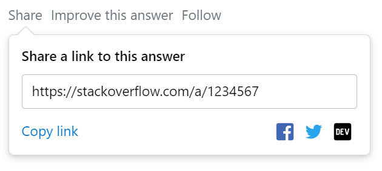

# so.sh

Save answers from [StackExchange](https://stackexchange.com/sites#) sites


## Getting started

```sh
mkdir -p $HOME/bin
cd $_
curl -O https://raw.githubusercontent.com/nntrn/so.sh/main/so.sh
```


## Usage

* **Step 1.** Copy answer share link
  
  

* **Step 2.** 
  ```
  $ so.sh <URL>
  ```

  Example: 
  ```console
  $ so.sh https://stackoverflow.com/a/8408487
  ```
